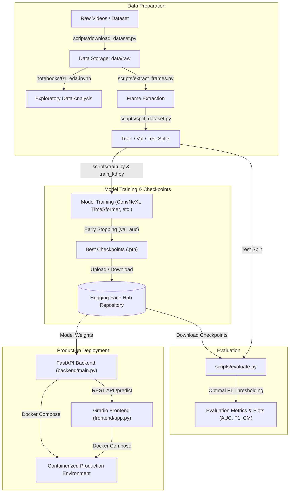

# Table of Contents
1. [Project Overview](#project-overview)
2. [End-to-End Pipeline Workflow](#end-to-end-pipeline-workflow)
3. [Data Source & Acquisition](#data-source--acquisition)
4. [Exploratory Data Analysis (EDA) Insights](#exploratory-data-analysis-eda-insights)
5. [Training Strategy & Evaluation Methodology](#training-strategy--evaluation-methodology)
6. [Model Architecture & Performance Comparison](#model-architecture--performance-comparison)
7. [Hugging Face Checkpoints](#hugging-face-checkpoints)
8. [Prerequisites & Environment Setup](#prerequisites--environment-setup)
9. [Running with Python (Local)](#running-with-python-local)
10. [Running with Docker (Recommended)](#running-with-docker-recommended)
11. [API Endpoints & Usage](#api-endpoints--usage)
12. [License](#license)

---

# Project Overview

With the rapid growth of synthetic media and AI-generated videos, detecting manipulated visual content has become increasingly important for media authenticity and cybersecurity. The **Video Deepfake Detection** project provides a modular pipeline that covers raw video processing, frame extraction, dataset splitting, model training, knowledge distillation, evaluation, and interactive inference.

The repository features:
- **Advanced Deep Learning Models**: Implementation of ConvNeXt, TimeSformer, Video Swin Transformer, Hybrid BiLSTM models, and Knowledge Distillation variants.
- **Data Analysis Pipeline**: Automated exploratory data analysis covering class distributions, frame rates (FPS), and video duration characteristics.
- **Production-Ready Services**: FastAPI backend handling inference requests and Gradio frontend providing an intuitive user interface.
- **Docker Containerization**: Seamless multi-container orchestration via Docker Compose.

---

# End-to-End Pipeline Workflow

The complete end-to-end pipeline of the repository spans from raw data acquisition and exploratory analysis to model training, evaluation, and production deployment. The workflow is illustrated in the Mermaid diagram below:



---

# Data Source & Acquisition

### 1. Dataset Source
The project primarily utilizes the **Deep Fake Detection (DFD) Entire Original Dataset**, which can be found on Kaggle:
- **Kaggle Link**: [Deep Fake Detection (DFD) Entire Original Dataset](https://www.kaggle.com/datasets/sanikatiwarekar/deep-fake-detection-dfd-entire-original-dataset)

### 2. Download and Extraction
To prepare the dataset for the pipeline, follow these steps:

**A. Download Dataset**:
Use the provided script to download the dataset to the `data/raw` directory:
```bash
python scripts/download_dataset.py --config configs/config.yaml
```

**B. Frame Extraction**:
Deep learning models process individual frames or sequences. Extract frames from the raw videos using:
```bash
python scripts/extract_frames.py --config configs/config.yaml
```
*This script will process the videos and save the extracted frames into the structured format required for training.*

**C. Dataset Splitting**:
Split the processed frames into training, validation, and testing sets:
```bash
python scripts/split_dataset.py --config configs/config.yaml
```

**Data Leakage Prevention:** To ensure robust generalization, the pipeline employs an Actor-Disjoint Splitting Strategy. Instead of random frame or video splitting, the dataset is partitioned based on unique actor IDs. This ensures that actors present in the training set never appear in the validation or test sets. Any videos containing actors from multiple splits are automatically discarded, forcing the model to learn generalizable deepfake features rather than memorizing specific actor faces.

---

# Exploratory Data Analysis (EDA) Insights

* **Class Imbalance**: The dataset has a strong class imbalance, with the Manipulated class containing about **8.5 times more videos** than the Original class. **$\Rightarrow$** Because of this imbalance, metrics such as AUC and F1-score are used to better evaluate whether the model can distinguish between the two classes instead of mainly predicting the majority class.

* **Frame Rate Consistency**: All examined original and manipulated videos have a frame rate of exactly **24.0 FPS**. This means that there are no differences in frame rate that could affect the frame sampling process.

* **Video Duration & Distribution**: Original videos have an average duration of **36.20 seconds**, while manipulated videos have an average duration of **30.46 seconds**. The manipulated videos also show a bimodal distribution, indicating that their video lengths vary more across the dataset.

* **Classification Implication**: The EDA shows that video duration and basic metadata have considerable overlap between the Original and Manipulated classes. Therefore, deepfake detection cannot rely only on video duration or simple metadata. The model needs to learn more meaningful **spatial and temporal features** from the video content.

---

# Training Strategy & Evaluation Methodology

The pipeline uses a training and evaluation strategy that focuses on both model selection during training and classification performance during testing:

* **Early Stopping & Checkpoint Selection**: During training, checkpoint selection and early stopping are based on validation **AUC-ROC (`val_auc`)**. This allows the model to be selected based on its ability to distinguish between the two classes across different classification thresholds, rather than using a fixed threshold.

* **Evaluation & Optimal Thresholding (`evaluate.py`)**: During evaluation, the script finds the **optimal decision threshold on the validation set** that gives the highest **F1-score**. This threshold is then applied to the test set to calculate the final **Accuracy, Precision, Recall, F1-Score, and AUC**. This approach helps choose a classification threshold that is more suitable for the dataset, especially given its class imbalance.

**Optimal Threshold Formula**

The optimal threshold $t^*$ is determined through an empirical search on the validation set to maximize the F1-score:

$t^* = \arg\max_{t \in T} F_1(y_{val}, \mathbb{I}(\hat{p}_{val} \geq t))$

Where:
- $T = \{0.05, 0.10, \dots, 0.95\}$ is the set of candidate thresholds.
- $y_{val}$ are the ground truth labels for the validation set.
- $\hat{p}_{val}$ are the predicted probabilities for the validation set.
- $\mathbb{I}(\cdot)$ is the indicator function.
- $F_1$ is the harmonic mean of Precision and Recall.

---

# Model Architecture & Performance Comparison

The framework evaluates multiple deep learning architectures trained on extracted video frames and temporal sequences. Below is the comparative performance metrics summary evaluated on test/validation splits using optimal validation-derived F1 thresholds:

| Model Architecture | Best Epoch | Val AUC | Test Threshold | Test Acc | Test Bal Acc | Test Prec | Test Rec | Test F1 | Test AUC | Test AP |
| --- | --- | --- | --- | --- | --- | --- | --- | --- | --- | --- |
| **ConvNeXt** | 10 | **0.6921** | 0.25 | 0.3021 | 0.5473 | 0.2472 | 1.0000 | **0.3964** | 0.6468 | 0.4206 |
| **ConvNeXt + KD** | 7 | **0.7265** | 0.50 | 0.3958 | 0.5762 | 0.2632 | 0.9091 | **0.4082** | 0.6216 | 0.3425 |
| **Hybrid BiLSTM** | 7 | **0.7140** | 0.30 | 0.4271 | 0.6284 | 0.2857 | 1.0000 | **`0.4444`** | 0.6886 | 0.4081 |
| **TimeSformer** | 9 | **0.7268** | 0.05 | 0.3958 | 0.6081 | 0.2750 | 1.0000 | **0.4314** | 0.7045 | 0.4883 |
| **Video Swin** | 1 | **0.5642** | 0.05 | 0.2292 | 0.5000 | 0.2292 | 1.0000 | **0.3729** | 0.4509 | 0.2162 |

*Note: Early stopping and best epoch checkpoint saving are driven by AUC (**`val_auc`**), whereas evaluation reports utilize validation-tuned F1 thresholds.*

---

# Hugging Face Checkpoints

To bypass lengthy training phases and run inference directly, my pre-trained model weights are hosted on Hugging Face. To download and utilize these checkpoints, you must provide your Hugging Face authentication token (`HF_TOKEN`).

## Available Checkpoint Repository & Paths
- **Hugging Face Hub Repository**: [ducbao210/video-deepfake-detection](https://huggingface.co/ducbao210/video-deepfake-detection)
- **Available Checkpoint Paths**:
  - `checkpoints/convnext/best_model.pth`
  - `checkpoints/convnext_kd/best_model.pth`
  - `checkpoints/hybrid_bilstm/best_model.pth`
  - `checkpoints/timesformer/best_model.pth`
  - `checkpoints/video_swin/best_model.pth`

---

# Prerequisites & Environment Setup

Ensure the system meets the following requirements:
- Python 3.10+
- Docker and Docker Compose (for containerized deployment)
- Git

Clone the repository:
```bash
git clone https://github.com/ducbao210/Video_deepfake_detection.git
cd Video_deepfake_detection
```

---

# Running with Python (Local)

When running the application locally using Python, **you must start the Backend service first**, ensuring the API is fully up and running, **before starting the Frontend interface**, as the frontend relies on backend API endpoints for processing and inference.

1. **Create and activate a virtual environment**:
   ```bash
   python3 -m venv venv
   source venv/bin/activate
   ```

2. **Install dependencies**:
   ```bash
   pip install --upgrade pip
   pip install -r requirements.txt
   pip install -r requirements-serve.txt
   ```

3. **Configure Environment Variables**:
   Copy `.env.sample` to `.env` and configure your Hugging Face token:
   ```bash
   cp .env.sample .env
   ```
   Edit `.env` and insert your token:
   ```env
   HF_TOKEN="your_actual_huggingface_token_here"
   TORCH_INDEX=https://download.pytorch.org/whl/cpu
   ```

4. **Step 1: Start the Backend Service (FastAPI)**:
   In your first terminal session, run:
   ```bash
   uvicorn backend.main:app --host 0.0.0.0 --port 8000 --reload
   ```
   *Verify that the backend is running by visiting [http://localhost:8000/docs](http://localhost:8000/docs).*

5. **Step 2: Start the Frontend Interface (Gradio)**:
   Open a **second separate terminal session**, activate the virtual environment, and run:
   ```bash
   python frontend/app.py
   ```
   *Access the interactive web UI at [http://localhost:7860](http://localhost:7860).*

---

# Running with Docker (Recommended)

The repository includes an automated setup script (`setup.sh`) and Docker Compose configuration that handles environment provisioning, token configuration, and multi-service orchestration (FastAPI backend + Gradio frontend) simultaneously.

1. **Run the automated setup script**:
   ```bash
   chmod +x setup.sh
   ./setup.sh
   ```
   *(The script will prompt you for your Hugging Face token, configure `.env`, build images, and start the containers).*

2. **Manual Docker Compose execution**:
   ```bash
   docker compose up --build -d
   ```

3. **Access Services**:
   - **Frontend UI**: [http://localhost:7860](http://localhost:7860)
   - **FastAPI Backend & API Docs**: [http://localhost:8000/docs](http://localhost:8000/docs)

4. **Stop Containers**:
   ```bash
   docker compose down
   ```

---

# API Endpoints

The FastAPI backend exposes standard REST endpoints for video analysis:
- `GET /health`: Health check endpoint verifying service status.
- `GET /models`: List available models and default configuration.
- `POST /predict`: Accepts video uploads, processes spatial-temporal frames, and returns deepfake probability scores and classification labels.

---

# License

This project is licensed under the **MIT License**. See the [LICENSE](LICENSE) file for details.
